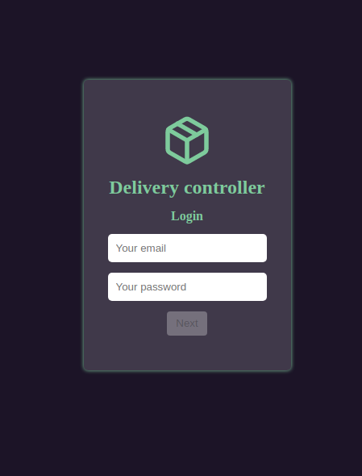
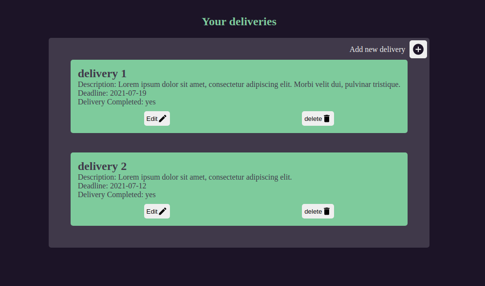
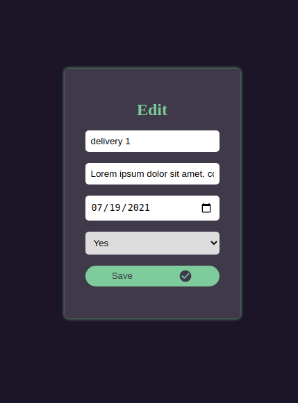

<h1 align="center">Delivery Controller</h1>
<br />

# :pushpin: Index
- [Project Media](#camera_flash-project-media)
- [About](#monocle_face-about)
- [Technologies](#rocket-technologies)
- [Authors](#closed_book-authors)
<br />

---
# :camera_flash: Project Media
<div align="center">
  
  
  
</div>
<br />

---

# :monocle_face: About
This project was developed to simulate a delivery manager, without communication with the back-end. For its execution, I use the concept of SPA ( Single-page application ) to make the application more fluid. So I decided to use React Router to manage the routes. State management is done using the Context API, as this application is small.
<br />

---

## Instalação do projeto localmente
After each step, there will be an example of the command to be typed to do what is being asked, in case you have difficulties and the example is not enough, don't hesitate to contact me at _devedmilson@gmail.com_.
1. Open the terminal and create a directory in the location of your choice with the command **mkdir**:
```javascript
  mkdir projects-edmilson
```
2. Enter the directory you just created and then clone the project:
```javascript
  cd projects-edmilson
  git clone git@github.com:EdmilsonBernardo/delivery-controller.git
```
3. install the dependencies and then run the project:
```javascript
  npm install
  npm start
```

# :rocket: Technologies
This project was developed with the following technologies: <br>
- :heavy_check_mark: **HTML**
- :heavy_check_mark: **CSS/SASS**
- :heavy_check_mark: **JavaScript**
- :heavy_check_mark: **ReactJS**
- :heavy_check_mark: **React Hooks**
- :heavy_check_mark: **Context API**
<br><br>
<br />

---

# :closed_book: Authors
By [Edmilson Bernardo](https://github.com/EdmilsonBernardo).
### :link: LinkedIn: https://www.linkedin.com/in/edmilsonbernardont/
